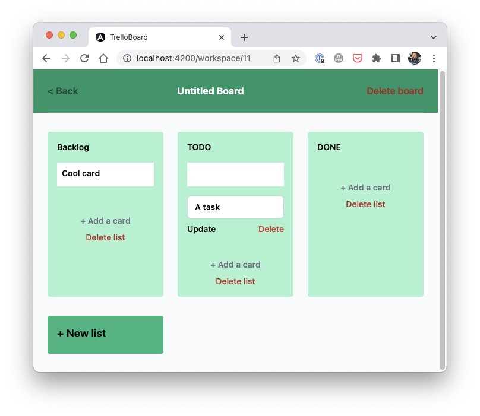

## Para levantar el proyecto

- Instalar las dependencias con `npm install`
- Crear instancias con supabase https://supabase.com/
- Editar o agregar la url del supabase en el .ts
- Habilitar Realtime en las tablas y en las tarjetas

# Supabase Angular Trello Board

A Supabase example with Angular and Tailwind.
